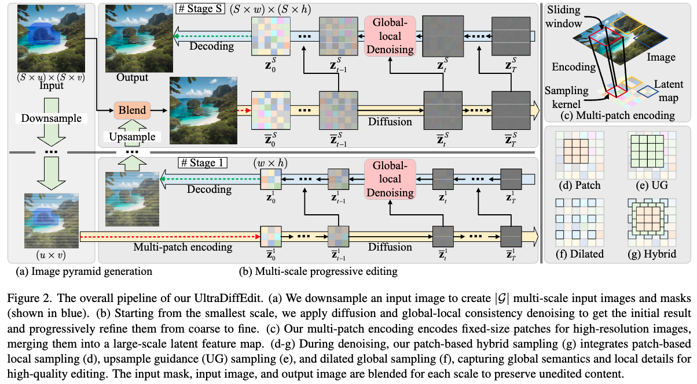
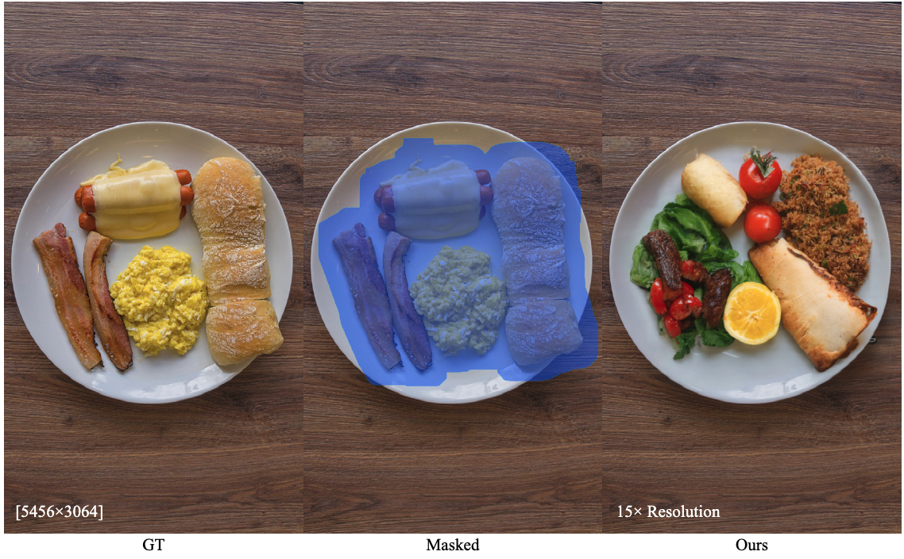

# UltraDiffEdit: Tuning-Free Latent Diffusion Models for Ultra High-Resolution Image Editing
[](https://ruoyidu.github.io/demofusion/demofusion.html)
[](https://arxiv.org/pdf/2311.16973.pdf)

[//]: # ([![Replicate]&#40;https://img.shields.io/badge/Demo-%F0%9F%9A%80%20Replicate-blue&#41;]&#40;https://replicate.com/lucataco/demofusion&#41;)

[//]: # ([![Open In Colab]&#40;https://colab.research.google.com/assets/colab-badge.svg&#41;]&#40;https://colab.research.google.com/github/camenduru/DemoFusion-colab/blob/main/DemoFusion_colab.ipynb&#41;)

[//]: # ([![Hugging Face]&#40;https://img.shields.io/badge/i2i-%F0%9F%A4%97%20Hugging%20Face-blue&#41;]&#40;https://huggingface.co/spaces/radames/Enhance-This-DemoFusion-SDXL&#41;)
[](https://badges.toozhao.com/stats/01JDF9WD6BEWJ37B9GN5J9G2Z1 "Get your own page views count badge on badges.toozhao.com")

Code release for "Tuning-Free Latent Diffusion Models for Ultra High-Resolution Image Editing" 




**Abstract**: <div style="text-align: justify"> Recent diffusion-based generative models have shown impressive performance in image generation and editing.
However, due to memory limitations and the expensive cost of collecting high-resolution images for training in ultra-high-resolution image editing, existing methods can only handle specific inputs, typically smaller than 1K.
Meanwhile, the resolution of photos captured with modern mobile devices increases up to 8K.
Simply upscaling low-resolution edited results often leads to enlarged but blurry images with a lack of details.
This paper introduces UltraDiffEdit, a novel tuning-free image editing framework that extends off-the-shelf latent diffusion models (LDMs) to ultra-high resolutions. 
UltraDiffEdit employs multi-scale progressive editing, iteratively blending high-resolution edited content with unedited areas in a coarse-to-fine manner. 
We employ multi-patch encoding to preserve both edited and unedited visual details within the latent space. 
To mitigate editing artifacts, our global-local consistency denoising technique seamlessly integrates edited and unedited latent features, 
ensuring smooth transitions at editing boundaries from latent space to the image domain.
A patch-based hybrid sampling is proposed to capture local, intermediate, and global features, ensuring semantic coherence and enhancing fine detail during denoising.
We have conducted experiments that demonstrate UltraDiffEdit's superior editing quality and flexibility. 
It can edit images up to 8K resolution using a just single NVIDIA GeForce RTX 3090 GPU. </div>

# News
 **2024.11.29**: 💰 [pipeline_ultradiffedit_sdxl.py](pipeline_ultradiffedit_sdxl.py) is released.

# Usage

## Starting with our code
### Hyper-parameters
- tar_height (`int`):
                The height in pixels of the edited image. This is set to Integer multiples of 1024.
                Anything below 512 pixels won't work well for
                [stabilityai/stable-diffusion-xl-base-1.0](https://huggingface.co/stabilityai/stable-diffusion-xl-base-1.0)
                and checkpoints that are not specifically fine-tuned on low resolutions.
- tar_width (`int`):
                The width in pixels of the generated image.This is set to Integer multiples of 1024.
                Anything below 512 pixels won't work well for
                [stabilityai/stable-diffusion-xl-base-1.0](https://huggingface.co/stabilityai/stable-diffusion-xl-base-1.0)
                and checkpoints that are not specifically fine-tuned on low resolutions.
- view_batch_size (`int`, defaults to 16):
                The batch size for multiple denoising paths. Typically, a larger batch size can result in higher 
                efficiency but comes with increased GPU memory requirements.
- multi_decoder (`bool`, defaults to True):
                Determine whether to use a tiled decoder. Generally, when the resolution exceeds 3072x3072, 
                a tiled decoder becomes necessary.
- stride (`int`, defaults to 64):
                The stride of moving local patches. A smaller stride is better for alleviating seam issues,
                but it also introduces additional computational overhead and inference time.
- beta_scale_1 (`float`, defaults to 3):
                Control the weights of diffused and denoised latent maps in global-local consistent denoising. 
- beta_scale_2 (`float`, defaults to 1):
                Control the weights of patch-based sampling, patch-based upsample guidance sampling, and dilated sampling in patch-based hybrid sampling. 
- cosine_scale_3 (`float`, defaults to 1):
                Control the strength of the gaussion filter. For specific impacts, please refer to Appendix C
                in the DemoFusion paper.
-  sigma (`float`, defaults to 1):
                The standard value of the gaussian filter.
-  show_image (`bool`, defaults to False):
                Determine whether to show intermediate results during generation.
-  file_name (`str`, defaults to ``out_img``):
                The file prefix of the saved output image.
-  save_root (`str`, defaults to ``results``):
                The root path of the saved output image.
-  save_image_tag (`bool`, defaults to False):
                Determine whether to save intemediate results, such as masked images, and masks.
-  run_stage (`str`, defaults to ``two``):
                define the phase set, using ``two``  to set the two stages, ``three``  to set the three stages, and ``S``  to set the S stages.
-  ug_weight (`float`, defaults to 0.2):
                the weight used for the patch-based upsample guidnace sampling.

### Text-guided real image editing
- Set up the dependencies as:
```
conda create -n demofusion python=3.9
conda activate demofusion
pip install -r requirements.txt
```
- Download [pipeline_ultradiffedit_sdxl.py](pipeline_ultradiffedit_sdxl.py) and run it as follows. 
```
from diffusers.utils import load_image
from pipeline_ultradiffedit_sdxl import  StableAnysizeInpaintPipeline  #
import time
import torch
import os

name_ = str(time.time())
os.makedirs("./results", exist_ok=True)
pipe = StableAnysizeInpaintPipeline.from_pretrained(
    "stabilityai/stable-diffusion-xl-base-1.0",
    torch_dtype=torch.float16,
    variant="fp16",
    use_safetensors=True,
)
pipe.to("cuda")

img_url = "https://raw.githubusercontent.com/CompVis/latent-diffusion/main/data/inpainting_examples/overture-creations-5sI6fQgYIuo.png"
mask_url = "https://raw.githubusercontent.com/CompVis/latent-diffusion/main/data/inpainting_examples/overture-creations-5sI6fQgYIuo_mask.png"

height = 2048
width = 2048

init_image = load_image(img_url).resize((width, height))
mask_image = load_image(mask_url).resize((width, height))

# prompt = "A majestic tiger sitting on a bench"
prompt = "a cute cat sitting on a bench"
negative_prompt = "blurry, ugly, duplicate, poorly drawn, deformed, mosaic"

generator = torch.Generator(device='cuda')  # random seed generator
generator = generator.manual_seed(5)

start = time.time()
images = pipe(
        prompt=prompt,
        negative_prompt=negative_prompt,
        image=init_image, 
        mask_image=mask_image, 
        num_inference_steps=50, strength=0.80,
        generator = generator,
        tar_height=height,
        tar_width=width,
        view_batch_size=16,
        stride=64,
        beta_scale_1=3, beta_scale_2=1, 
        cosine_scale_3=1, sigma=0.8,
        multi_decoder=True, show_image=False,
        save_image_tag = False,
        file_name=name_,
        save_root='./results',
        ug_weight = 0.2,
    )
images[-1].save(f"results/{name_}_finalout.png")
end = time.time()
print('time for running is : %s Seconds' % (end - start))
```

- Please feel free to try different prompts and resolutions.
- Default hyper-parameters are recommended, but they may not be optimal for all cases. 
- The code was cleaned before the release. If you encounter any issues, please contact us.

## Citation
If you find this paper useful in your research, please consider citing:
```

```

## Acknowledgements

The authors would like to thank [Diffusers](https://github.com/huggingface/diffusers) and  [DemoFusion](https://github.com/PRIS-CV/DemoFusion) for their awesome work!
